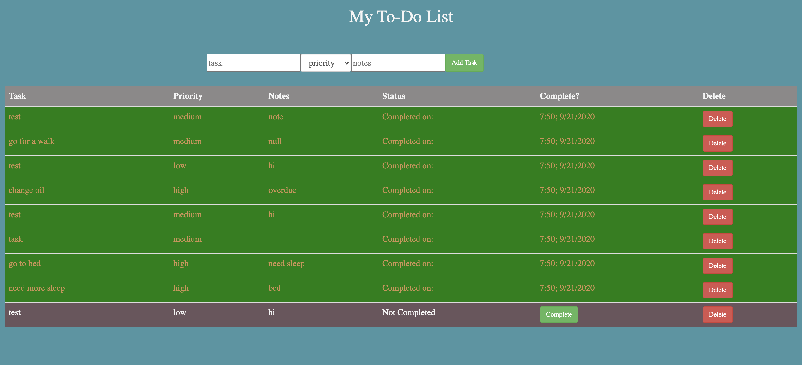

# To Do App
## Description
_Duration:_ Weekend project
This is a basic to do list, where a user can make a checklist of things to do and mark them off as them complete them.

In building this app, I practiced skills for full stack integration, connecting a jquery-powered front end through a node server to a SQL database.

## Screenshots

## Prerequisites npm 
To run this app you will need:
-Node.js
-PostGreSQL

## Install
To run this application:
- create a database in postgres called `weekend-to-do-app`
- Execute the SQL commands from `database.sql`
- Run `npm install` from the project root directory
- Run `npm start` to run the node server
- Open `http://localhost:3000` in your server

## Usage
Write a todo item in the text box and click _Create!_ to add a new item.
Click the checkbox next to the item to makas complete.
Ckick the delete button to remove a task.
